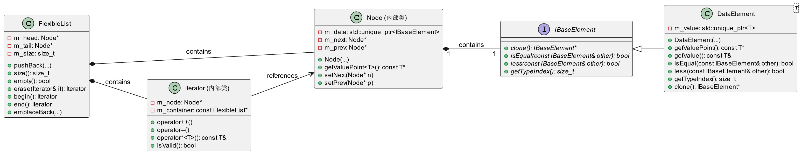

# 自定义类库设计与实现

## 题目描述

要求在C++中创建一个类似于标准模板库（STL）的自定义类库。这个类库需要包含以下三个主要组件：

1. **FlexibleList**：能够存储不同类型数据的灵活列表容器。
2. **AdvancedSort**：高级排序算法。
3. **FlexibleIterator**：自定义迭代器。

这些组件需具备良好的性能、可扩展性，并能处理异常情况。此外，建议进行性能测试来比较自定义类库和STL相似功能之间的性能差异。

## 设计思路

### 核心设计

#### 接口与抽象类 (`IBaseElement`)

- 定义了 `IBaseElement` 抽象类，它包含了若干纯虚函数如 `clone`, `isEqual`, `less`, 和 `getTypeIndex`。
- 这些函数为所有继承自 `IBaseElement` 的类提供了基本的行为规范。

#### 模板类 (`DataElement<T>`)

- `DataElement<T>` 是一个模板类，继承自 `IBaseElement`。
- 通过这种方式，它可以存储任意类型的值，并保持统一的接口。
- 提供了多种构造函数支持不同的初始化方式，包括移动语义和完美转发。
- 实现了 `IBaseElement` 中的所有纯虚函数，允许在运行时进行类型安全的操作。

#### 节点 (`Node`)

- `FlexibleList` 内部定义了一个私有的 `Node` 类，用于表示链表中的节点。
- 每个 `Node` 包含一个指向 `IBaseElement` 的智能指针 `m_data`，这意味着每个节点可以存储任何继承自 `IBaseElement` 的对象（在这里即 `DataElement<T>`）。
- `Node` 还包含指向下一个节点 (`m_next`) 和前一个节点 (`m_prev`) 的指针，以形成双向链表结构。

#### 迭代器 (`Iterator`)

- `FlexibleList` 提供了一个内部迭代器类 `Iterator`，用于遍历列表。
- 迭代器知道如何访问当前节点的数据 (`m_node->getValuePoint()`) 并提供了一系列操作符重载方法来支持迭代器的标准用法（如 `++`, `--`, `*` 等）。
- 迭代器还维护了一个指向其所属 `FlexibleList` 实例的指针 (`m_container`)，以确保迭代操作的有效性和安全性。

#### 主要功能

- `FlexibleList` 提供了常见的列表操作，如 `pushBack`, `insertFrontIt`, `erase`, `popBack` 等，以及获取列表大小、检查是否为空等辅助函数。
- 特别注意的是，由于使用了 `std::unique_ptr<IBaseElement> m_data;` 来存储数据，`FlexibleList` 能够存储不同类型的元素而不需要提前确定类型。

### 总结

`FlexibleList` 的实现展示了如何利用面向对象编程的概念（如多态性）和C++特性（如模板、智能指针）来创建一个灵活的数据结构，使得列表的每个节点都可以存储不同类型的数据。这种方法不仅提高了代码的灵活性和可复用性，同时也保证了类型安全。

## 类图结构

## 性能测试

对 `FlexibleList` 和 `std::list` 在插入、删除、遍历等方面的性能进行了对比测试。具体信息请参见：

- [FlexibleList/FlexibleList/benchmarkTestResult.txt](./benchmarkTestResult.txt)
- [FlexibleList/FlexibleList/FlexibleList-vs-stdlist.txt](./FlexibleList-vs-stdlist.txt)